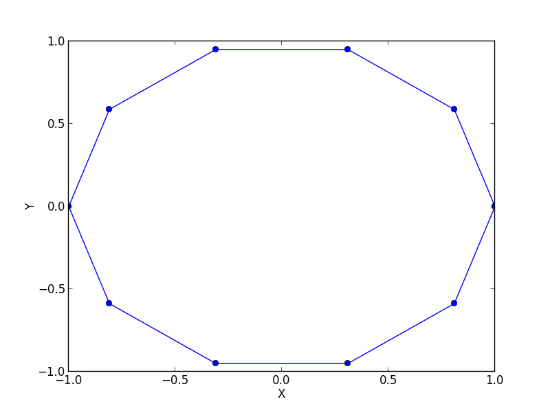
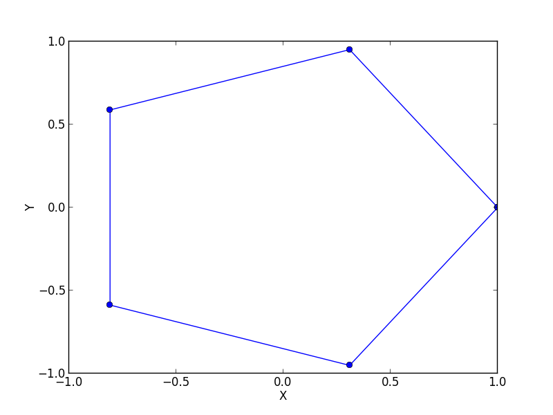
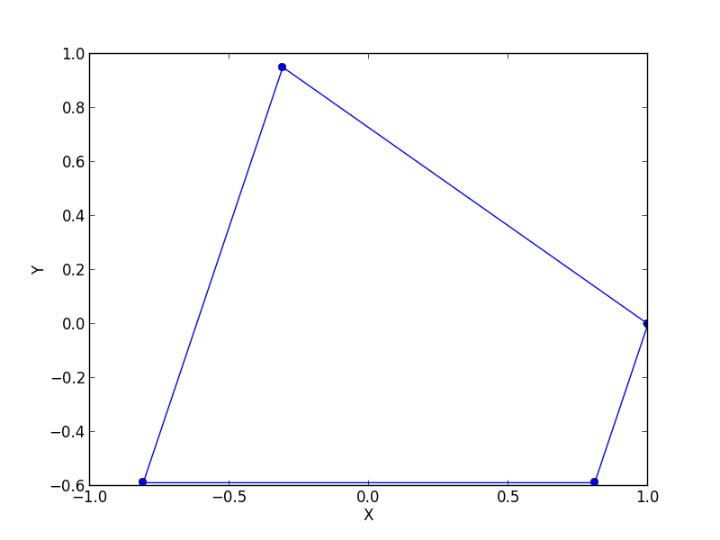

uniform\_select: Elementary Downsampling of Trajectories
===================

Numerous algorithms in trajectory computing are getting unreasonably complex when invoked with large trajectories.
Therefore, `uniform_select` provides a very simple way of reducing the number of points inside a given trajectory.

The algorithm is based on choosing the first trajectory element and every k-th following element. With a parameter,
you can define whether the last point shall always be added to the trajectory or not. 

For a regular 10-gon, the figures at the end of this article show the results of choosing k=2 and k=3. 

Quick Reference
-------------------
	// Function template
	template<class TrajectoryType>
	TrajectoryType uniform_select(TrajectoryType &t,size_t Step=15,bool withEndPoint=true)
	
	// Typical Use
	trajcomp::uniform_select(t,25);

Sample Code
-------------
The following code sample shows how to use `uniform\_select` for downsampling trajectories.

[uniform\_select.cpp](uniform_select.cpp)

	#include<trajcomp/trajcomp.hpp>
	#include<vector>

	using namespace std;
	using namespace trajcomp;

	typedef trajcomp::trajectory<double> traj;

	int main() 
	{
		traj t(2);
		t.push_back({1.0d,1.0d});
		t.push_back({2.0d,2.0d});
		t.push_back({3.0d,3.0d});
		t.push_back({4.0d,4.0d});
		t.push_back({5.0d,5.0d});
		t.push_back({6.0d,6.0d});
		t.push_back({7.0d,7.0d});
		t.push_back({8.0d,8.0d});
		cout << "Reducing from:" << endl;
		t.dump();
		
		traj q(2);
		cout << "Every second and the last:" << endl;
		q = trajcomp::uniform_select(t,2);
		q.dump();
		cout << "Every third and the last:" << endl;
		q = trajcomp::uniform_select(t,3);
		q.dump();
		cout << "Every third:" << endl;
		q = trajcomp::uniform_select(t,3,false);
		q.dump();
 		return 0;
	}	

This example first creates a two-dimensional trajectory and then select different subsets as trajectories.

Compilation
------------
In order to compile this sample, libtrajcomp must be installed or the compiler needs to be enabled to find trajcomp.hpp included from the first line. For G++, you can use

	g++ -std=c++11 -o sample uniform_select.cpp

Note the `-std=c++11` switch, which enables modern C++ support. 

Running the Sample
-----------------
This sample outputs the following text string:

	Reducing from:
	1 1 
	2 2 
	3 3 
	4 4 
	5 5 
	6 6 
	7 7 
	8 8 
	Every second and the last:
	1 1 
	3 3 
	5 5 
	7 7 
	8 8 
	Every third and the last:
	1 1 
	4 4 
	7 7 
	8 8 
	Every third:
	1 1 
	4 4 
	7 7 

Concepts and Custom Types
------------------------------

The implementation makes use of the following functions which your custom types must support: 

* 	Dimension constructor (`trajectory t(2)`)
*	Trajectory::iterator (used as a forward iterator)
*	trajectory::push_back
*	trajectory::size
*	trajectory::back

Examples
-------------

The Input Polygon

The result of simplifying this ngon with k=2

The result of simplifying this ngon with k=3

Python Code used to create these figures:

	import trajcomp;
	from operator import itemgetter 
	import matplotlib.pyplot as plt
	from matplotlib.patches import Rectangle

	def printfig(name,traj):
		C=trajcomp.get(traj);
		X = map(itemgetter(0), C) ;
		Y = map(itemgetter(1), C);
		plt.clf();
		fig, ax1 = plt.subplots()
		ax1.plot(X, Y, '-o')
		ax1.set_xlabel('X')
		ax1.set_ylabel('Y')
		#plt.show()
		plt.savefig(name)

	A=trajcomp.load("../../data/ngon10.dat");
	B=trajcomp.uniform_select(A,2,True);
	C=trajcomp.uniform_select(A,3,True);

	printfig("uniform_select_in.png",A);
	printfig("uniform_select_2.png",B);
	printfig("uniform_select_3.png",C);

