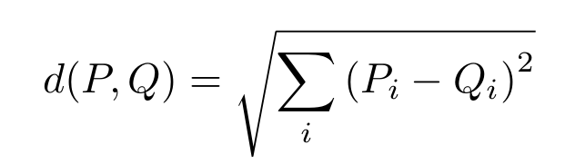

default\_element\_distance: Euclidean Distance between Points
===================
When working with spatial data, a very basic operation is to calculate the distance between two points. 
For the trajectory computing library, we decided to represent points as vectors of some user-defined 
type such that you can decide whether these should be double, integer or whatever. For this case, we 
provide the interface `element_distance` and an Euclidean implementation `default_element_distance`.

The Euclidean distance is defined to be the square root of the squares of the distances of the differences of the various dimensions of two vectors.

Quick Reference
-------------------
	// Class template
	template<class sample_type> 
	class default_element_distance: public element_distance<sample_type,double>
	
	// Typical Use
	trajcomp::default_element_distance<std::vector<double>> d;

Sample Code
-------------
The following code sample shows how to instantiate a Euclidean distance object and how to calculate the distance between two points. Note that we are using some modern C++ features, which have to be activated in some compilers.

[default\_element\_distance.cpp](default_element_distance.cpp)

	#include<trajcomp/trajcomp.hpp>
	#include<vector>

	using namespace std;
	using namespace trajcomp;

	int main() {
	    std::vector<double> p {1.0d, 1.0d};
	    std::vector<double> q {3.0d, 3.0d};
	    
	    trajcomp::default_element_distance<std::vector<double>> d;

	cout << "The distance between "
		 << tools::make_string(p) 
		 << " and "
		 << tools::make_string(q) 
		 << " is "
		 << d(p,q) << endl;	
	    
	    return 0;
	}

This example first creates two vectors p and q, then instantiates the default_element_distance class for this type of points. Then, inside the long cout statement, the variables p and q are converted to a string using the function 	`make_string` from the namespace `trajcomp::tools` and give the result of calculating the distance.

Compilation
------------
In order to compile this sample, libtrajcomp must be installed or the compiler needs to be enabled to find trajcomp.hpp included from the first line. For G++, you can use

	g++ -std=c++11 -o sample element_distance.cpp

Note the `-std=c++11` switch, which enables modern C++ support. 

Running the Sample
-----------------
This sample outputs the following text string:

	The distance between 1 1  and 3 3  is 2.82843

Concepts and Custom Types
------------------------------

The implementation of the element distance expects a vector-like type. So if you want to use your own types, the following methods must be implemented

* 	`size()` returning the number of elements of your own storage class
*	access operator [] for accessing elements as sample_type
*	double-valued substraction of two objects

The following sample shows how you can use a classical object-oriented class storing two-dimensional points can be used with trajcomp algorithms by operator overloading

[default\_element\_distance\_custom\_type.cpp](default_element_distance_custom_type.cpp)

	#include<trajcomp/trajcomp.hpp>
	#include<vector>

	using namespace std;
	using namespace trajcomp;

	class Point
	{
		public:
			double x;
			double y;
	
		Point(double thex,double they):x(thex),y(they)
		{
		}
		// provide some interface for vector-style access
		
		const size_t size() { return 2; };
		double operator[] (size_t where)
		{
			return (where == 0)?x:y;
		}
		
	
		// provide a double-valued substraction
		double operator- (Point &p)
		{
			return sqrt( (x-p.x)*(x-p.x) + (y-p.y)*(y-p.y));
		}
		
		friend std::ostream & operator<<(std::ostream &os, const Point& p)
		{
			os << p.x << " " << p.y;
			return os;
		}
			
	};

	int main() {
	    Point p(1,1);
	    Point q(3,3);
        
	    trajcomp::default_element_distance<Point> d;

		cout << "The distance between "
			 << p
			 << " and "
			 << q 	
			 << " is "
			 << d(p,q) << endl;	
    
	    return 0;
	}

